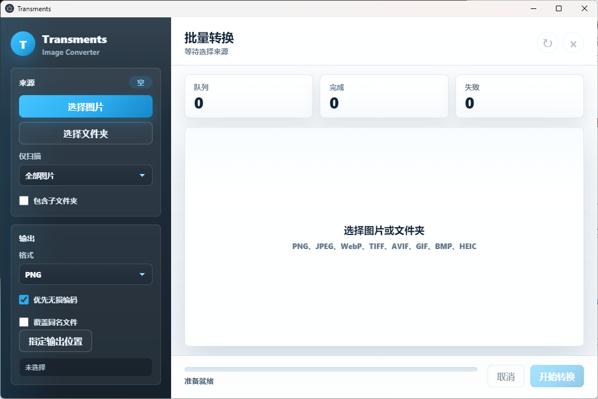

# Transments

> A lightweight, polished image format converter built with Electron.

Transments 是一个轻量化图片格式转换器，面向日常高频的图片整理、格式迁移和批量处理场景。它采用 Electron 技术栈构建桌面图形界面，界面风格参考 Telegram：清晰、克制、响应迅速，并保留足够的高级感。

## Highlights

- **轻量桌面应用**：无前端构建器，原生 HTML/CSS/JS renderer，启动路径简单。
- **批量文件夹转换**：可选择整个文件夹，按某一格式筛选图片后批量转换。
- **自定义输出目录**：转换结果可输出到指定位置。
- **递归扫描支持**：可包含子文件夹，并保留相对目录结构，减少同名文件冲突。
- **常见格式互转**：支持 PNG、JPEG、WebP、TIFF、AVIF、GIF、BMP。
- **HEIC 支持**：支持 HEIC/HEIF 输入，并可输出 HEIC。
- **Telegram 风格 UI**：深色侧栏、清爽工作区、平滑交互动效、HarmonyOS Sans SC 字体优先。

## Preview



当前界面围绕四个核心区域组织：

- 左侧来源选择：选择图片、选择文件夹、格式筛选、递归扫描。
- 左侧输出设置：目标格式、无损优先、覆盖策略、输出目录。
- 右侧批量队列：展示待转换文件、状态与路径信息。
- 底部执行区：转换进度、实时状态、取消与开始转换。

## Format Support

| Format | Input | Output | Notes |
| --- | --- | --- | --- |
| PNG | Yes | Yes | 适合透明图和无损输出 |
| JPEG / JPG | Yes | Yes | 输出使用高质量设置 |
| WebP | Yes | Yes | 支持 lossless 输出 |
| TIFF / TIF | Yes | Yes | 使用 LZW 压缩 |
| AVIF | Yes | Yes | 支持 lossless 输出 |
| GIF | Yes | Yes | 支持常见静态/动画输入场景 |
| BMP | Yes | Yes | 内置 BMP 输出路径 |
| HEIC / HEIF | Yes | Yes | HEIC 解码与 WASM 编码支持 |

## Tech Stack

- **Electron**: 桌面应用运行时
- **Sharp**: 高性能图片处理核心
- **heic-decode**: HEIC/HEIF 输入解码
- **elheif**: WASM HEIC 编码
- **Vanilla HTML/CSS/JS**: 轻量 renderer，无额外前端框架

## Project Structure

```text
Transments
├── src
│   ├── main
│   │   ├── index.js
│   │   └── converter-service.js
│   ├── preload
│   │   └── index.js
│   └── renderer
│       ├── index.html
│       ├── renderer.js
│       └── styles.css
├── test
│   └── converter.test.js
├── package.json
└── README.md
```

## Getting Started

Install dependencies:

```bash
npm install
```

Start the app:

```bash
npm start
```

Run tests:

```bash
npm test
```

## Usage

1. 点击 **选择图片** 添加多个独立图片，或点击 **选择文件夹** 批量扫描目录。
2. 在 **仅扫描** 中选择要筛选的源格式，例如只处理 `.png`。
3. 如需处理子目录，开启 **包含子文件夹**。
4. 在 **输出** 区选择目标格式。
5. 点击 **指定输出位置** 选择转换结果目录。
6. 点击 **开始转换**，在队列中查看每个文件的转换状态。

## Design Notes

Transments 的 UI 以效率工具为核心，不做复杂的营销式页面。视觉策略更接近 Telegram 桌面端：

- 深色侧栏承载设置，右侧浅色区域承载任务队列。
- 交互元素有平滑 hover、active、focus 状态。
- 按钮悬停时带轻微缩放与阴影变化，反馈明确但不过度。
- 字体优先使用 `HarmonyOS Sans SC`，整体字重偏粗，提升中文界面的清晰度。

## Development Notes

转换逻辑集中在 `src/main/converter-service.js`：

- `scanFolder()` 负责按格式扫描目录。
- `start()` 负责批量转换调度。
- `convertOne()` 负责单文件转换。
- HEIC 输入通过 `heic-decode` 转为 RGBA。
- HEIC 输出通过 `elheif` WASM 编码器生成。

Renderer 通过 preload 暴露的 `window.transments` API 与主进程通信，保持 `contextIsolation` 开启，避免直接暴露 Node 能力到页面。

## Roadmap

- 添加转换完成后的输出目录快捷打开。
- 增加拖拽文件/文件夹导入。
- 增加转换历史记录。
- 增加输出文件命名模板。
- 增加应用打包配置与安装包生成。
- 增加更多真实图片样本测试。

## License

MIT
