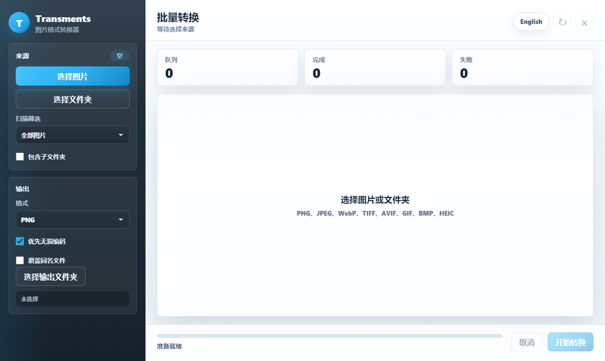

# Transments

> 基于 Electron 构建的轻量、精致图片格式转换器。

Transments 是一款面向日常图片整理、格式迁移和文件夹批量处理的桌面工具。它采用轻量 Electron 技术栈，界面风格参考 Telegram：清晰、克制、响应迅速，并支持中英文双语切换。

## 语言

- 中文：当前文件
- 英文：[README.md](README.md)

软件内置中英文切换功能，可通过右上角工具栏中的语言/设置按钮在英文和中文之间切换。

## 预览



界面围绕四个核心区域组织：

- 来源选择：选择单张或多张图片、扫描文件夹、按输入格式筛选、包含子文件夹。
- 输出设置：选择目标格式、优先无损编码、控制覆盖策略、指定输出文件夹。
- 批量队列：查看文件、路径和每个文件的转换状态。
- 操作栏：跟踪进度、取消任务、开始转换。

## 功能亮点

- **轻量桌面应用**：使用原生 HTML/CSS/JS renderer，无前端构建流水线。
- **双语界面**：可在软件内切换英文和中文。
- **批量文件夹转换**：扫描整个文件夹，并只转换需要的源格式。
- **自定义输出位置**：转换结果可输出到指定目录。
- **递归扫描**：可包含子文件夹，并保留相对目录结构。
- **常见格式互转**：支持 PNG、JPEG、WebP、TIFF、AVIF、GIF 和 BMP。
- **HEIC 支持**：支持 HEIC/HEIF 输入，并通过 WASM 编码器输出 HEIC。
- **Telegram 风格高级 UI**：深色侧栏、清爽工作区、平滑交互动效，以及优先使用 HarmonyOS Sans SC 的字体栈。

## 格式支持

| 格式 | 输入 | 输出 | 说明 |
| --- | --- | --- | --- |
| PNG | 支持 | 支持 | 适合透明图和无损工作流 |
| JPEG / JPG | 支持 | 支持 | 使用高质量编码设置 |
| WebP | 支持 | 支持 | 支持无损输出 |
| TIFF / TIF | 支持 | 支持 | 使用 LZW 压缩 |
| AVIF | 支持 | 支持 | 支持无损输出 |
| GIF | 支持 | 支持 | 支持常见静态和动画输入场景 |
| BMP | 支持 | 支持 | 使用内置 BMP 写入逻辑 |
| HEIC / HEIF | 支持 | 支持 | HEIC 解码与 WASM HEIC 编码 |

## 技术栈

- **Electron**：桌面应用运行时
- **Sharp**：高性能图片处理核心
- **heic-decode**：HEIC/HEIF 输入解码
- **elheif**：WASM HEIC 编码
- **Vanilla HTML/CSS/JS**：轻量 renderer，无额外 UI 框架

## 项目结构

```text
Transments
|-- preview
|   |-- main.png
|   `-- main.zh-CN.png
|-- scripts
|   |-- capture-preview.js
|   `-- verify-i18n.js
|-- src
|   |-- main
|   |   |-- index.js
|   |   `-- converter-service.js
|   |-- preload
|   |   `-- index.js
|   `-- renderer
|       |-- index.html
|       |-- renderer.js
|       `-- styles.css
|-- test
|   `-- converter.test.js
|-- package.json
|-- README.md
`-- README.zh-CN.md
```

## 快速开始

安装依赖：

```bash
npm install
```

启动应用：

```bash
npm start
```

运行测试：

```bash
npm test
```

验证软件内语言切换：

```bash
npm run verify:i18n
```

重新生成中英文预览截图：

```bash
npm run capture:preview:all
```

只生成英文预览图：

```bash
npm run capture:preview:en
```

只生成中文预览图：

```bash
npm run capture:preview:zh
```

## 使用方式

1. 点击 **选择图片** 添加单个或多个文件，或点击 **选择文件夹** 扫描目录。
2. 使用 **扫描筛选** 指定源格式，例如 PNG 或 HEIC。
3. 如需递归处理目录，开启 **包含子文件夹**。
4. 在 **输出** 区选择目标格式。
5. 点击 **选择输出文件夹** 指定转换结果的保存位置。
6. 点击 **开始转换**，在队列中查看转换进度。
7. 点击右上角语言/设置按钮，可在英文和中文之间切换。

## 设计说明

Transments 的定位是实用效率工具，而不是营销页面。视觉系统参考 Telegram 桌面端：

- 深色左侧栏集中承载来源与输出设置。
- 浅色工作区保证队列信息清晰易扫。
- 按钮、选择器、复选框、队列行和状态元素都有平滑 hover、active 和 focus 动效。
- 按钮悬停时带有轻微缩放与阴影变化，形成更高级的触感反馈。
- 字体栈优先使用 `HarmonyOS Sans SC`，并使用偏粗字重，保证中英文界面都有清晰的桌面阅读体验。

## 开发说明

转换逻辑位于 `src/main/converter-service.js`：

- `scanFolder()` 按源格式扫描目录。
- `start()` 调度批量转换任务。
- `convertOne()` 处理单个文件转换。
- HEIC 输入通过 `heic-decode` 解码为 RGBA。
- HEIC 输出通过 `elheif` WASM 编码器生成。

Renderer 通过 preload 暴露的 `window.transments` API 与主进程通信。应用保持 `contextIsolation` 开启，因此不会把 Node 能力直接暴露给界面。

## 路线图

- 添加转换完成后快捷打开输出目录。
- 增加文件和文件夹拖拽导入。
- 增加转换历史记录。
- 增加输出文件命名模板。
- 增加应用打包配置与安装包生成。
- 增加更多真实图片样本测试。

## 许可证

MIT
